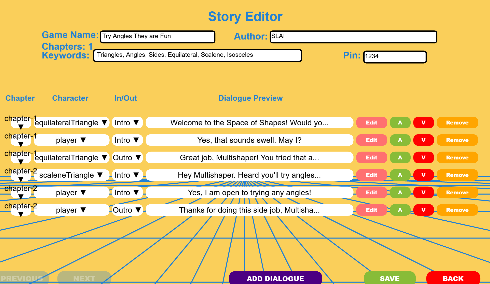

# MAGIC-lab-thvo-summary
NSF-funded project I worked on at the MAGIC lab, a summary.
# THVO Educational Game – MAGIC Lab @ UW–Madison

This is a project summary of my contributions to **THVO**, an interactive educational game developed at the **MAGIC Lab (Mathematical Action and Gesture in Instruction and Cognition lab)**, part of an NSF-funded initiative in human-computer interaction and learning.

> **Note**: Codebase is private and IP is owned by MAGIC Lab. This repo is for portfolio and demo purposes only.

---

## 🎮 About the Project

**THVO** is a game designed to teach logic, strategy, and memory through exploratory gameplay, built for classroom and research-based deployment. The game integrates a visual UI, progressive difficulty scaling, and live feedback loops based on student input.

---

## 👨‍💻 My Role

As an undergraduate software developer on the team, I contributed to:

- **Frontend Gameplay Logic**: Implemented core interaction systems in Python, including game state transitions, user feedback triggers, and win/loss logic  
- **Backend Flask Services**: Built modular endpoints for loading levels, managing save states, and logging gameplay events for analysis  
- **UI/UX Iteration**: Designed and refined visual layouts, menus, and user flows to improve accessibility and engagement during classroom testing  
- **Playtesting & Data Collection**: Ran controlled user sessions, captured gameplay data and pose-matching logs, and synthesized feedback into design improvements  
- **Computer Vision Support (Embodied Learning)**: Supported the integration of a webcam-based pose recognition pipeline (MediaPipe/OpenCV) to capture player movements in real time; validated pose-matching logic and synced it to educational game sequences focused on geometric transformations  
- **Cross-Disciplinary Collaboration**: Worked with HCI researchers, educators, and developers to align technical implementation with instructional goals and data collection needs for NSF-backed research

---

## 🧠 Technologies Used

- Python  
- Flask  
- Git / GitHub  
- JSON-level serialization  
- Educational design principles

---

## 🖼️ Screenshots

Screenshots below represent stages I helped build or test:

| Gameplay | Level Editor | Feedback Screen |
|----------|--------------|------------------|
|  |  |  |

---

## 🔍 Research Context

This project is part of a National Science Foundation grant focused on adaptive learning tools and human-computer interaction. More details will be available upon academic publication.

For more about MAGIC Lab: [https://magiclab.wceruw.org/](https://magiclab.wceruw.org/)
