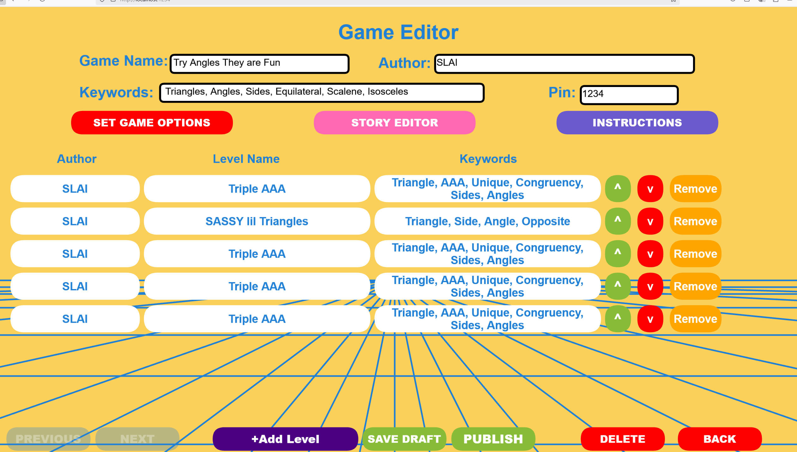

# MAGIC-lab-The Hidden Village Online
NSF-funded project I am working on at the MAGIC lab, a summary.
# THVO Educational Game – MAGIC Lab @ UW–Madison

This is an ongoing project summary of my contributions to **THVO**, an interactive educational game developed at the **MAGIC Lab (Mathematical Action and Gesture in Instruction and Cognition lab)**, part of an NSF-funded initiative in human-computer interaction and learning.

> **Note**: Codebase is private and IP is owned by MAGIC Lab. This repo is for portfolio and demo purposes only.
> > 🔒 This repository contains public documentation of my contributions to the THVO project at MAGIC Lab. The images shown are from internal development builds and are used with permission for non-commercial portfolio purposes. No source code or proprietary datasets are included.


---

## 🎮 About the Project

**THVO** is a game designed to teach logic, strategy, and memory through exploratory gameplay, built for classroom and research-based deployment. The game integrates a visual UI, progressive difficulty scaling, and live feedback loops based on student input.

---
## ⚙️ Architecture (High-Level)

- **Client:** React app with a **PixiJS** 2D renderer for low-latency scenes and UI overlays.
- **State orchestration:** **XState** finite state machines coordinate chapter → tutorial → pose-match → feedback → next-level flow.
- **Pose input:** **MediaPipe** (webcam) provides live landmarks; a thin adapter maps pose events to in-game actions.
- **Data layer:** **Firebase** (Auth, Realtime Database, Storage) for role-based access (student/teacher/researcher), session logging, and phase video uploads.
- **Services:** **Flask** endpoints for level metadata, session handoff, and export helpers (source is private; representative shapes below).

## 🔄 Game Flow (XState Snapshot)

```text
[Splash]
  → [ChapterSelect]
  → [Tutorial]
  → [PoseMatch]
      ↔ [Intervention]  # teacher hint / scaffold
  → [Feedback]
  → [PuzzleSolved]
  → [NextLevel | ChapterSelect]
```
---
## 👨‍💻 My Role

As an undergraduate software developer on the team, I have contributed to:

- **Frontend Gameplay Logic**: Implemented core interaction systems in Python, including game state transitions, user feedback triggers, and win/loss logic  
- **Backend Flask Services**: Built modular endpoints for loading levels, managing save states, and logging gameplay events for analysis  
- **UI/UX Iteration**: Designed and refined visual layouts, menus, and user flows to improve accessibility and engagement during classroom testing  
- **Playtesting & Data Collection**: Ran controlled user sessions, captured gameplay data and pose-matching logs, and synthesized feedback into design improvements  
- **Computer Vision Support (Embodied Learning)**: Supported the integration of a webcam-based pose recognition pipeline (MediaPipe/OpenCV) to capture player movements in real time; validated pose-matching logic and synced it to educational game sequences focused on geometric transformations  
- **Cross-Disciplinary Collaboration**: Worked with HCI researchers, educators, and developers to align technical implementation with instructional goals and data collection needs for NSF-backed research
---

## 🧩 Core Systems (Engineering)

- **Renderer:** PixiJS scene graph (sprites, hit areas, HUD, dynamic text) with a deterministic tick loop for consistent timing.
- **State machines:** XState charts per domain (Game, Level, UI) with guards/assign/actions; transitions are testable and support replay from event logs.
- **Classroom mode:** Role-based menus (student/teacher/researcher), lesson chooser, and in-game editors for levels/narrative.
- **Telemetry & export:** Per-session UUID + device identity; JSON→CSV export via an admin **Data** menu; per-phase video captured with the browser **MediaRecorder** API and uploaded to Firebase Storage.
- **Latency & stability:** Debounced pose events, batched reducers, and minimal layout thrash to keep input→feedback under target bounds.

---

## 🧠 Technologies Used

- Python  
- Flask  
- Git / GitHub  
- JSON-level serialization  
- Educational design principles

---


## 🖼️ Screenshots

The THVO game leverages **real-time computer vision** (powered by MediaPipe) to track student body movements. Players physically act out geometric poses using their arms and legs, which are recognized by the system and matched to target poses on-screen. This system promotes **embodied learning**—an approach shown to enhance retention and understanding of abstract concepts like congruence and angle relationships.

Below are screenshots of key parts of the system:

| **Pose Matching Phase** | **Gameplay Interface** |
|--------------------------|------------------------|
|  |  |

| **Game Editor** | **Level Editor** |
|------------------|------------------|
|  |  |

| **Main Menu** |
|----------------|
|  |


---
## 🧪 Pilot Snapshot

- **Setting:** 4-week classroom pilot with 30+ middle-school students.
- **Data:** multi-GB telemetry (pose + clickstream + per-phase video, consented).
- **Result:** children's learned geometry 25% faster than those learning without the game (paper-pencil lessons, normal teaching), had higher scores on practice tests afterwards - Overall Success

## 🔐 Privacy & IP

- No PII in this repo; sessions use anonymous device/session IDs.
- Code and datasets are private and owned by MAGIC Lab; this README documents **design and integration** details for technical review.
---
## 🔍 Research Context

This project is part of a National Science Foundation grant focused on adaptive learning tools and human-computer interaction. More details will be available upon academic publication.

For more about MAGIC Lab: [https://magiclab.wceruw.org/](https://magiclab.wceruw.org/)

--- 
## 👥 Ownership

Co-Lead Developer along with Tejas Gupta on gameplay systems, state orchestration, classroom mode, and data export tooling; collaborated with HCI researchers and teachers on iteration and deployment readiness.

